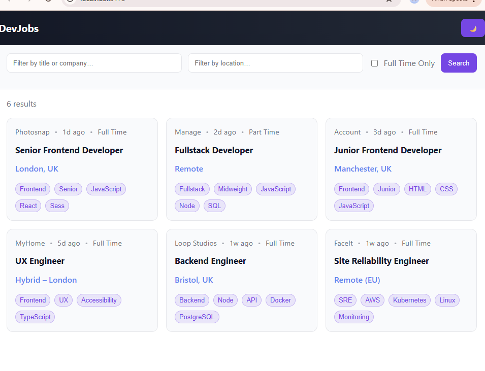

# DevJobs — Vanilla JS


Responsive job board UI in **HTML/CSS/JS** (no frameworks). Features: search, location & tag filters, **Full Time only**, and **dark mode** (persistent). Accessible (keyboard + ARIA). **Playwright e2e tests** with **GitHub Actions CI**.

**Live:** https://Giuseppe552.github.io/devjobs-vanilla/

---

**Quick start**

```bash
npm ci
npm run dev

---
Tests

Copy
Edit
npm test


---
Tech used:

HTML, CSS, JavaScript, Playwright, GitHub Actions, GitHub Pages.


---
Desktop view:

